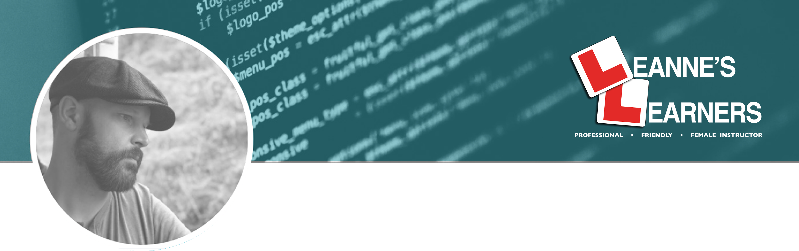
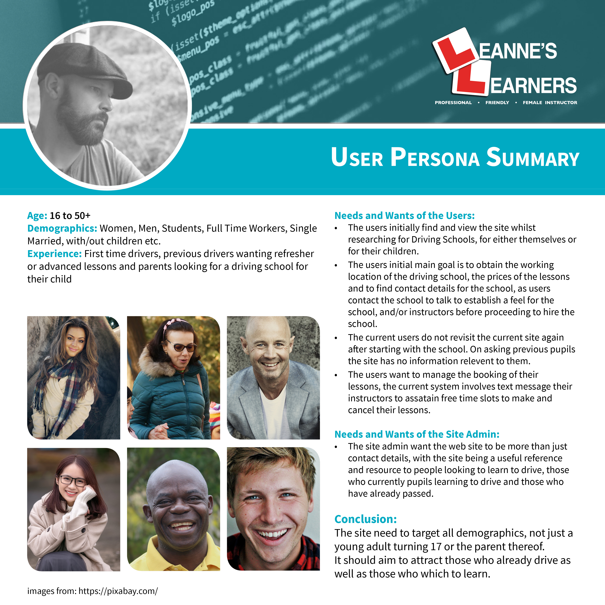
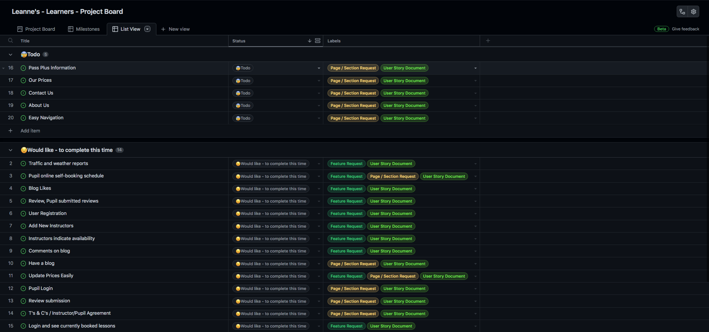
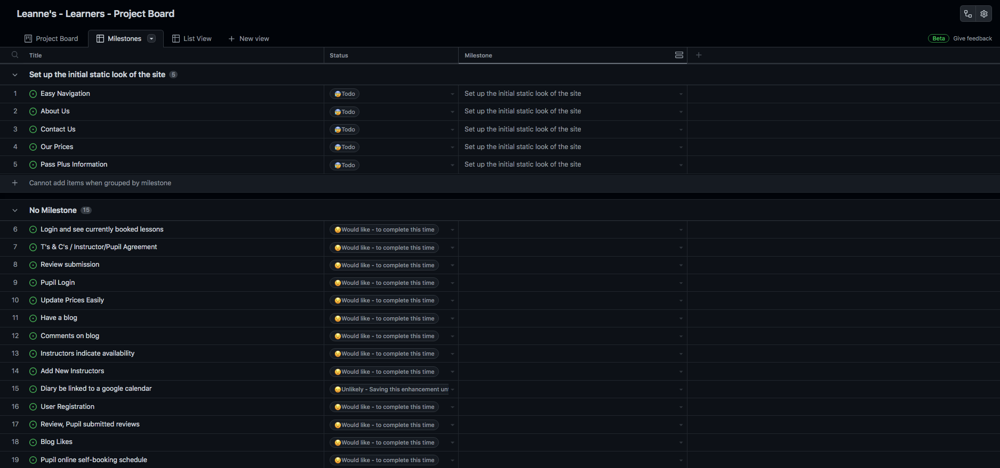
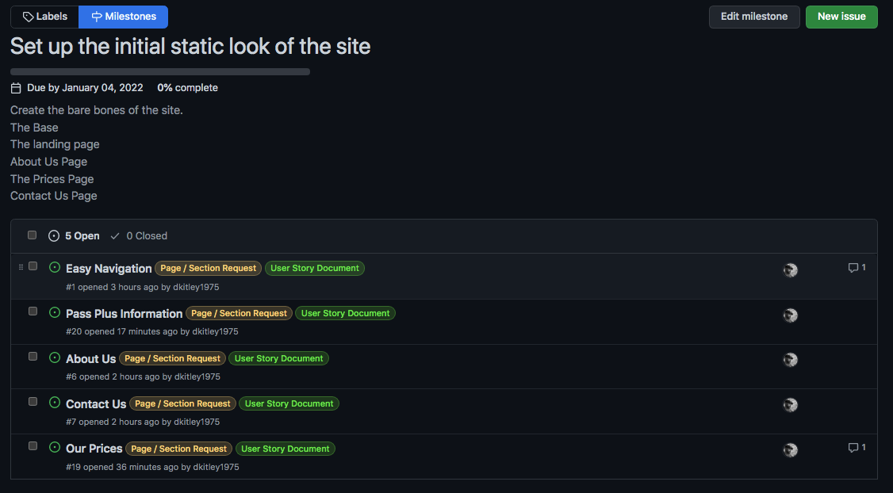
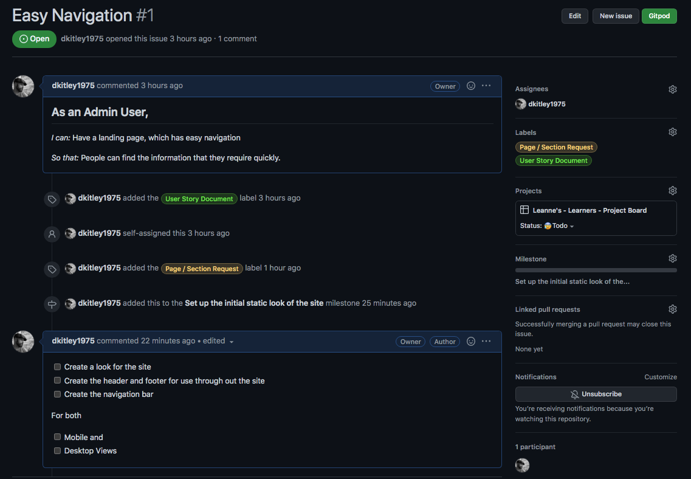
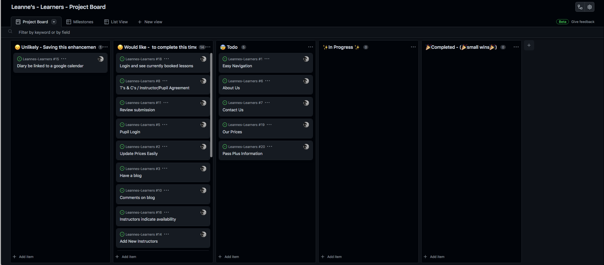
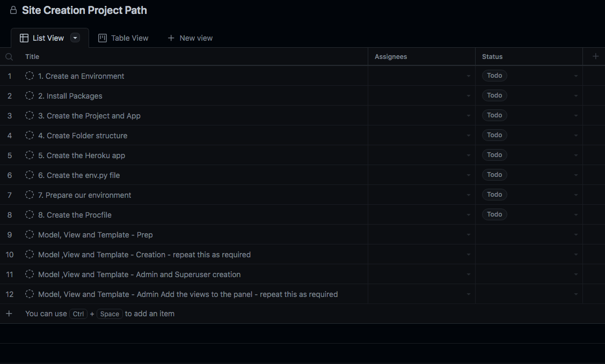
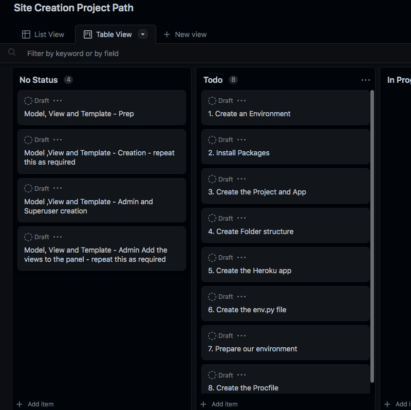
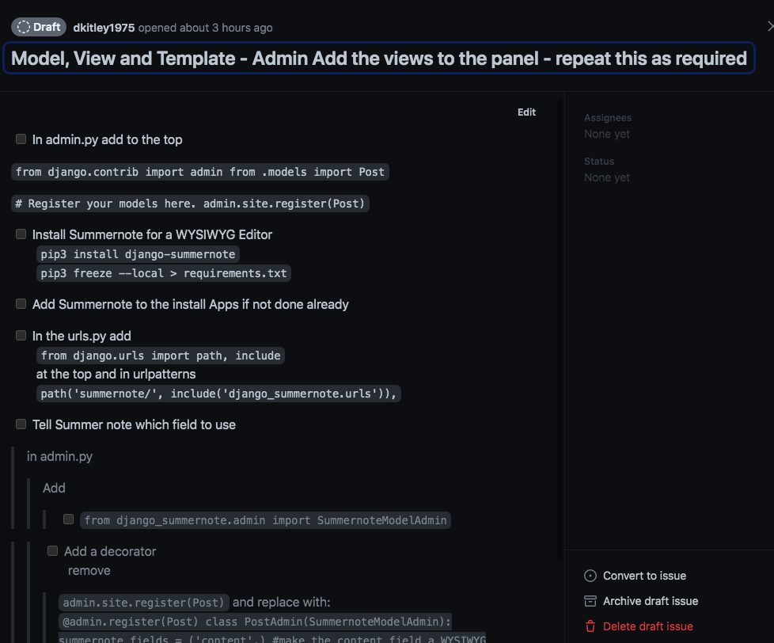

[](https://www.linkedin.com/in/david-kitley-mcnamara)

This is the documentation regarding the creation of the Leanne's Learners website.
This is my 4th Portfolio Project for the Code Institute's Diploma in Full Stack Development.  
The projects purpose:
To build a Full-Stack site based on business logic used to control a centrally-owned dataset. Including an authentication mechanism and providing role-based access to the site's data or other activities based on the dataset.

# Leannes Learners [](https://www.linkedin.com/in/david-kitley-mcnamara)

<!--TODO CONTENTS HERE-->

## UX (User Experience)

### User Stories

* As a user
  * I want to know where the Leanne's Learners are located
  * I want to see the service's Leanne's Learners offer.
  * I want to be able to see the prices.
  * I want to know about the company.
  * I want to be able to contact the company.
  * I want to be able to easily book my lessons.
  * I want to be able to easily cancel my lessons.
  * I want to get a confirmation email with my appointment time.

### Site Owner Goals

* As a site owner
  * I want to show where Leanne's Learners operate.
  * I want to show the prices.
  * I want to let people see the services we offer
  * I want to let people easily contact us either by email or phone.
  * I want to make it easy for pupils to book lessons.
  * I want to get an email when a pupil requests to make or cancel a lesson.
  * I want to be able to confirm a pupils requests to make or cancel a lesson.
  * I want to be able to cancel pupils lessons.
  * I want to be able to get email from site users through a contact form

## User Persona Summary 

## Project Board

I Used Github's Project board to plan the project and Github Issue's for User Stories and Tasks [here](https://github.com/users/dkitley1975/projects/9)  

*Project Board listed by Status*
  

*Project Board listed by Milestone*
  

*First Milestone with Tasks added*


*User Story with Tasks added*
  

*Project Board Kanban, with Automation*
  

### Site Creation Path Project Board

In addition to User Stories and Tasks Project board I also created a Site Creation Path Board Used Github's Project board again to plan the projects creation path.

*Site Creation Path Board List View*


*Site Creation Path Board Table View*


*Site Creation Path Board Indiviual Item View*


## Design

### Fonts

### Colors

### Wireframe

#### Desktop


#### Mobile
<!-- TODO Update this -->


## Technologies

### Languages

* HTML
* CSS
* Python
* Django

### Frameworks and Tools

* [GitHub](https://github.com/)
* [Gitpod](https://www.gitpod.io/)
* [Django](https://www.djangoproject.com/)
* [Heroku](https://www.heroku.com/home)
* [Postgres](https://www.postgresql.org/)
* [Google Fonts](https://fonts.google.com/)
* [Font Awesome](https://fontawesome.com/)
* [W3C HTML Validation](https://validator.w3.org/)
* [H3C CSS Validation](https://jigsaw.w3.org/css-validator/validator.html.en)
* [http://pep8online.com/](http://pep8online.com/)
* [Am I responsive](http://ami.responsivedesign.is/)
* [WebAim](https://webaim.org/resources/contrastchecker/)

### Contrast Checker


## Features

The website has the following features:

### Navigation bar


### Home


### Services


### Contact us


### Login


### Manage


### Admin


### Registration/Login


### User/Logout


## Testing

### Code Validation

### HTML

The W3C Markup Validation Service was used to validate the HTML page of the project. No errors or warnings to show.

#### Home Page

#### Service Page

#### Contact-Us Page

#### Appointment Page

#### Manage-Appointment Page

### CSS

The W3C CSS Validation Service was used to validate the CSS file used for the project. No errors or warnings to show.

### Python

The PEP8 Online Check was used to validate all Python code. No errors or warnings to show

### Different Screen Size

The site is optimized for all screen sizes and tested with a Macbook Pro 13" and iPhone 13 Pro.
I use media queries to make everything look and feel good on mobile devices.

### Issues found during site development and their Solutions

1. When adding the localhost as an ALLOWEDHOST in the settings page, I continued to receive an Django error indicating the host needed to be added to the allowed host settings.

    * As this was being developed locally in VS Code. I tried editing the hosts file via -

      ```bash
      sudo nano /private/etc/hosts
      ```

      Saving the changes by pressing ```ctrl + O```, then exiting by pressing ```ctrl + X```  

    This error continues - but if http://localhost:8000/ or http://127.0.0.1:8000/ are used in the address bar the site works, just not directly from the link in the output message in the terminal.

1.

## Deployment

1. On the home screen click on create new app button
2. Enter a name for the project and select your region to the correct region
3. On the next screen select settings
4. Go to config vars and click reveal config vars
5. Switch to the program file and where you are keeping your credentials copy these and then on Heroku enter a name for the key and paste the code into the config vars value box and click add
6. Now scroll down to buildPacks and click add build packs
7. First select python and click save changes
8. Click back into build packs and choose node.js and click save again
9. Ensure that the Python build pack is at the top of the list you are able to drag and drop if you need to rearrange
10. Now select deploy
11. From the deployment method select GitHub
12. Then click on connect to Github button that appears
13. Click into the search box and search for the project name
14. Once located select connect
15. Then click deploy branch, this will then be shown in the box below
16. You can the click view to show the app in a browser

The program is set to be deployed automatically after each push from gitpod.

I also set up a Postgres database with Heroku.

1. Click on Resources in your Heroku app.
2. In the add-ons field search for Heroku Postgres and press submit.

### Cloning

How to clone this repository.

* On GitHub go to the main page of the Repository.
* Above the list of files click the code button with the drop-down arrow.
* To clone the repository using HTTPS, under "Clone with HTTPS", click on the clipboard.
* Open the Git Bash terminal.
* Change the current working directory to the location where you want the cloned directory.
* Type git clone, and then paste the URL you copied earlier from step 3.
* Press Enter to create your local clone.

## Credits
